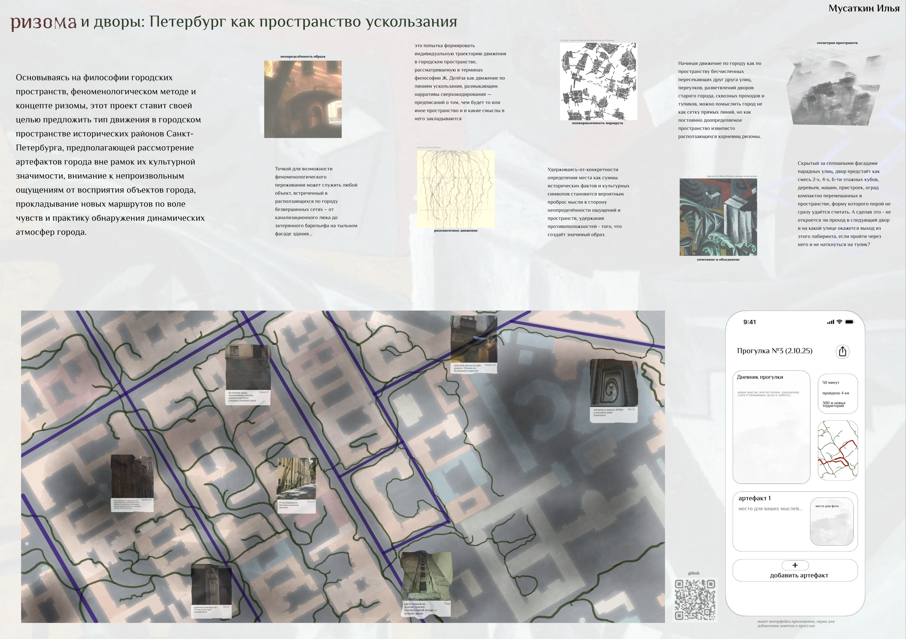

# petersbourgrhizome

Основываясь на философии городских пространств, феноменологическом методе и концепте ризомы Ж. Делёза, этот проект ставит своей целью предложить новое осмысление опыта пребывания в городском пространстве исторических районов Санкт-Петербурга, предполагающее рассмотрение артефактов города вне рамок их культурной значимости и внимание к непроизвольным ощущениям от восприятия объектов городского пространства. Задачей проекта является проектирование приложения, позволяющего фиксировать подобные ощущения, делиться ими с другими людьми и формировать индивидуальную траекторию движения в городском пространстве, рассматриваемую в терминах философии Ж. Делёза как движение по линиям ускользания, размыкающим нарративы сверхокодирования — предписаний о том, чем будет и какие смыслы закладываются в то или иное место в городском пространстве.

Сейчас проект в поиске конкретного воплощения, испытывается форма (1) приложения с картой, (2) игры с элементами стохастики и (3) нарративного сценария. По мере развития шаги будут отображаться в этом репозитории.

С текущей версией эссе, из которого выросло визуальное представление в виде постера можно ознакомится в файлах репозитория.

Контакты автора:
telegram: @involontaire
